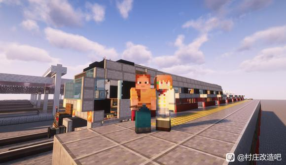
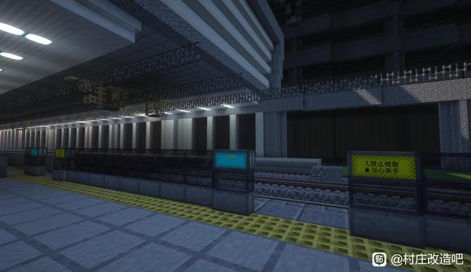
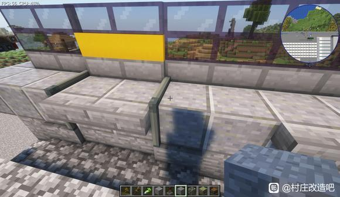
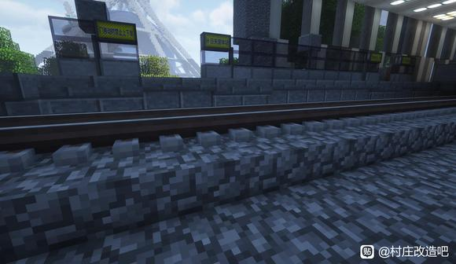
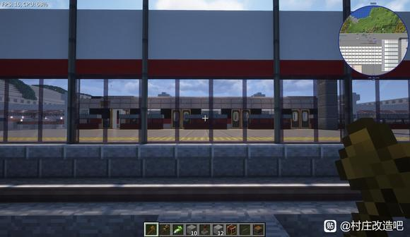
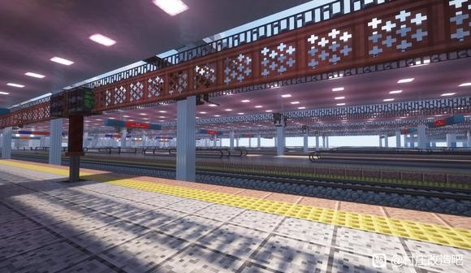
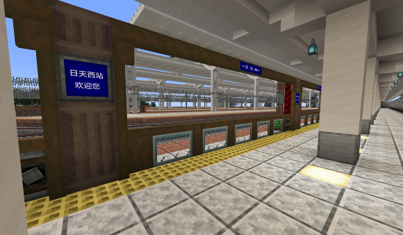
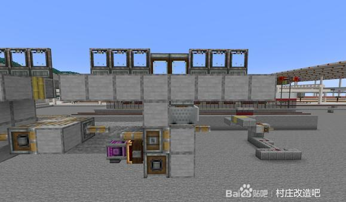

2025年11月中旬以来，创意港湾合作服务器内进行了一次由多位吧友共同参与的站台屏蔽门研发攻关。此次研究旨在总结一段时间以来对机械动力模组特性的理解与机械制造的技巧，尝试在机械动力模组的机械条件下实现车站常见的屏蔽门使用效果。研发过程产生了丰硕的成果，活跃了吧友间的技术切磋与交流，并逐步推进实装，以惠及全吧铁路的技术革新需要。

---

!

最初，初版屏蔽门被制作出来。在机械动力6.0更新后，用机械动力活塞和强力胶推动的多方块结构已经无法穿模。按照一般思路研发的屏蔽门会把站台结构整个移动，且使用一次后就会出现整机错位，无法投入实际使用，但这一尝试确定了基本的技术基础。

---

!

遠山禾将用于胶粘门的连接方块切换成伪装切杆，并进一步缩小了推动屏蔽门移动的动力结构体积，改善了门与动力结构的连接方式。这一版本基本解决了站台结构整体移动以及使用一次就会整机错位的问题，可以正常使用，但动力部分的占地面积仍然过大。

---

!

Zhongnan在2.0版本的基础上进行了大幅度改进，克服了体积过大的问题。他采用多种能节省占地空间的机械动力方块，显著缩小了移动结构的占地空间，这一版本被定为3.0版。此时屏蔽门已经能够安装在大部分站台上，并开始在日天环线通勤铁路的车站进行安装。随后苏晴晴在3.0版本基础上做了进一步缩减占地的3.5版。

---

!

在日天环线通勤铁路车站的实际安装中，团队发现需要更为小巧的屏蔽门动力结构。于是遠山禾在苏晴晴的3.5版本基础上继续缩减动力结构的大小。同时考虑到传导门移动的连接方块（如伪装切杆等）会严重切割站台——为了避免站台被推动而不可避免出现的缺口——遠山禾利用多种伪装版组合，大幅修改了传导门移动的连接结构，实现了与站台固有结构的协和，站台上不再有任何缺口。这可以说是目前研究中最为究极的成果。

---

!

与此同时，团队基于3.0版本开发了可移动的全高屏蔽门，以备不时之需。

---

!

此外，基于机械动力的综合运用，还开发了上下移动型的屏蔽门版本。该型号由Zhongnan研发，适用于大型火车站中不便于对标车门的超长站台，目前已在峡东的东方站实装。

---

!

苏晴晴基于这一屏蔽门，仿照苏州站升降门，为日天西站的通勤铁路站台安装了站台门。

---

!

同时，苏晴晴利用新的思路——移动矿车结构，制作了可穿模的屏蔽门，实现了更小的占地面积。但矿车一旦运动速度过快就会漂移，导致门关不上，正常的关门速度则没有问题。

---

!

随后，日天通勤环线配套屏蔽门工程使用研发所得技术，在日天国体站安装完毕，标志着此次屏蔽门研发取得成效。后续这些成果将推广到创意港湾的更多线路当中。

---

吧服研发的屏蔽门成果被总结成视频发布在B站，获得了数万播放量。这是创意港湾为Minecraft社群带来的新贡献，也鼓舞了创意港湾的吧友们：我们有信心，也有能力创造出大家喜闻乐见的内容。

---

总结成就，放眼未来。创意港湾将继续努力，为大家带来更多有趣的内容，也让各位吧友在创意港湾玩得开心。