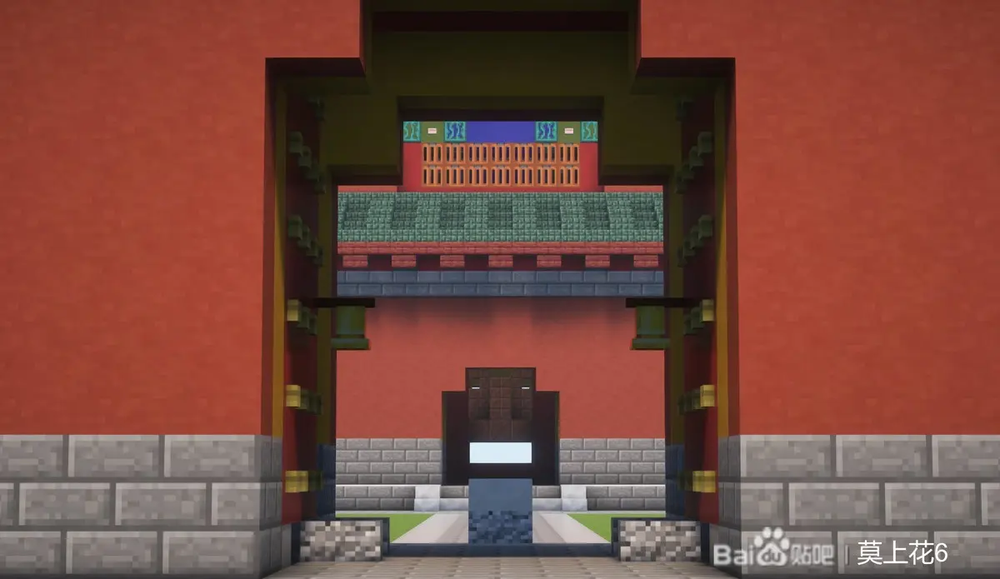
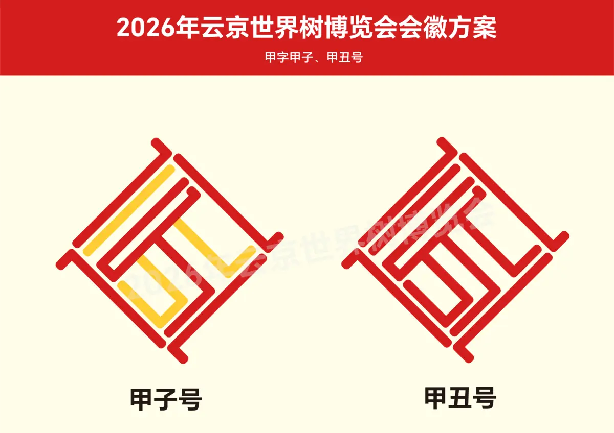
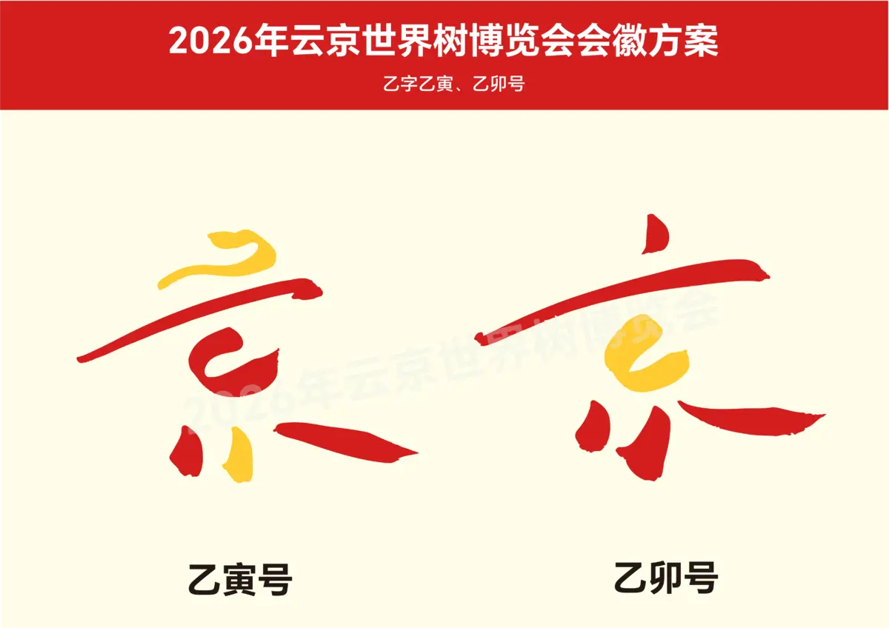

去年的暑假，在世界树联合2025年8月常会上，云京市成为第二届世界树博览会的举办城市。

天盛云京市申办第二届世界树博览会的主题是：**同舟共进，航向未来**。根据天盛提交的申办材料，天盛将在某较大水域建造世博会会场。每个文明的场馆都由至少一座船舶来承载，船舶、场馆的形制可以依照各个文明自身的设计进行调整。

目前，第二届世界树博览会的筹备工作正进一步推进。根据天盛方面的消息：5月17日，2026年云京世界树博览会组委会正式发布本届博览会会徽设计草案，面向公众公开征求意见。本次公示的多套方案以"云京"为创作核心，深度融合首善文化底蕴、东方美学精神与世界树联合，传递本届盛会"彰显京华，与世界同行"的办会理念。

本次公示的会徽草案分为"甲字"与"乙字"两大系列，共4套设计方案，均立足首善文化特质展开创作。

**"甲字"系列**以线条化的几何造型演绎篆书"云京"二字嵌套在天盛结中，甲子号方案融入象征生机的明黄线条，在规整的框架中呼应故宫红墙黄瓦的经典配色，于秩序感中彰显京华气象；甲丑号则以纯粹的朱红线条勾勒轮廓，简洁庄重的造型暗含云京中轴线的对称美学，传递古云京的沉稳气度。

**"乙字"系列**采用灵动的书法笔触，乙寅号、乙卯号均以红色为主色调，搭配点缀的暖黄，将"云京"二字的笔画艺术化重构，既保留汉字的识别性，又巧妙融入天盛结舒展的意象，兼具毛笔书法的笔韵张力与首善之都的雅致意境，实现了东方美学与古都人文的有机统一。

两种方案发布后，欢迎吧友们积极反馈意见。最终将根据意见确定会徽。
