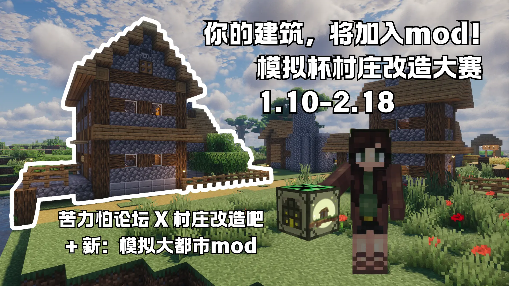
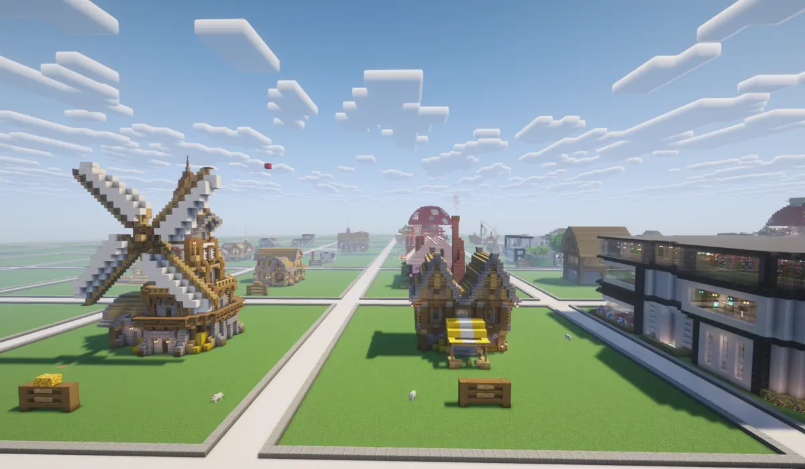

当第一块方块被放置，当第一座村庄迎来新生，我们便知道——这场关于创造与分享的旅程，注定不凡。

由苦力怕论坛"创意港湾"版块联合百度贴吧村庄改造吧共同主办，模拟城市Mod重制版开发团队深度支持的 **"模拟杯"村庄改造设计大赛**，自2026年1月20日启动以来，历时一个月，于2月19日圆满落下帷幕！

作为村庄改造吧发展历程中的重要里程碑，本次比赛汇聚了来自全国各地的Minecraft爱好者，既有经验丰富的建筑团队，也有初次尝试的“建筑萌新”。他们在创意港湾的号召下，积极响应苦力怕论坛”推动原创内容、鼓励玩家共创“的宗旨，用方块书写故事，用设计传递温度。

比赛期间，我们共收到**29个优秀参赛作品**，涵盖住宅、商业、工业、其他四大类别。每一份投稿，都让我们耳目一新。

## 创作者联结创作者，作品点亮作品

本次大赛的一大亮点，是引入了**参赛者互评机制**，让每一位创作者都有机会欣赏彼此的作品，并在投票中感受不同风格的碰撞。从现代别墅到巨型蘑菇房，从海船之商到钟鼓楼，从铁匠铺到冒险者公会——每一座建筑都承载着作者的心血，也激发了更多人的灵感。

正是这种"创作者联结创作者"的氛围，让本次比赛不仅切磋技术，而且让吧友们学会了分享。许多参赛者在满意度调查中表示：”参加比赛使我发现了分享作品的重要性“”发帖为自己的建筑创作故事十分新颖，有助于我的建筑创作“。

经过**互评投票（40%）**与**评委评审（60%）**的严格评选，最终获奖作品名单如下：

### 住宅类

- **金奖**：巨型蘑菇房（作者：乌龙）
- **银奖**：现代三层别墅（作者：YF）
- **铜奖**：林地小屋（作者：腾星月lucky）、现代双层别墅（作者：OTeam）

### 商业类

- **金奖**：枫烨旅馆（作者：枫烨、路人汀）
- **银奖**：复合集合点（作者：傻傻骐）
- **铜奖**：海船之商（作者：莫吉托鸡尾酒）、枫烨酒馆（作者：枫烨）

### 工业类

- **金奖**：枫烨磨坊（作者：枫烨、Can_dy）
- **银奖**：砖厂（作者：惯宣）
- **铜奖**：升级铁匠铺（作者：Nosevil）

### 其他类

- **金奖**：冒险者公会（作者：幻觉来了我超）
- **银奖**：枫烨监狱（作者：枫烨、枫烨FZ）
- **铜奖**：公园市政厅（作者：采矿与合成）

### 最佳人气奖

- **落雨・钟磬** —— 简朴钟鼓楼（作者：遠山禾）

恭喜以上获奖作者！你们的作品将有机会经过优化后，正式加入模拟城市Mod重制版（Java 1.20.1），与万千玩家共享你们的创意成果。

## 未完待续——"模拟杯"周边比赛正式启动！

比赛虽告一段落，但改造的脚步从未停歇。为了让更多mod的经典建筑焕发新生，村庄改造吧现正式启动**"模拟杯"周边比赛——新模拟大都市旧版建筑改造计划**！

### 【活动简介】

面向所有建筑爱好者，征集对新版模组中已收录的旧版建筑进行升级改造的作品。你的改造将为模组世界增添更多美感与细节，让老建筑在新版本中重获新生！

### 【改造条件】

- 保留旧版建筑原有风格与用途
- 建筑用材尽量不变（为美观可合理调整）
- 建筑尺寸尽量不变（允许轻微扩大）
- 版本要求：Java 1.20.1
- 投稿数量不限，一人可投多个建筑

### 【投稿方式】

1. 在百度贴吧"村庄改造吧"发帖，格式参考示例贴，内容包括改造建筑名称、原有模样图片、改造后模样图片
2. 将存档文件发送至QQ：**83924011**
3. 您也可以在创意港湾服务器中进行建造，可以无需发送存档文件，直接投稿

### 【改造建筑名单】

2室房、2层楼住宅、大房子B、超小房子、圆石小屋、多彩羊毛房、大豪宅、双层木板房、大型木板住房、大型木质别墅、街角小屋、带门廊的小屋、普通的小房子（及2、3）、石木小型住宅、凝灰居所、图书馆住宅、圆石小住宅、一室一厅、中世纪砖房、砖块小型别墅

详见贴吧有关帖子。

### 【参考投稿贴】

[https://tieba.baidu.com/p/10527566424](https://tieba.baidu.com/p/10527566424)

## 写在最后

首届"模拟杯"的成功举办，离不开每一位参赛者的倾情投入，离不开评委团的辛勤付出，更离不开苦力怕论坛与模拟城市Mod开发团队的大力支持。通过这次比赛，我们不仅收获了无数优秀作品，更让"村庄改造"这一玩法深入人心——它可以是实用的、唯美的、充满故事的，甚至是幽默的、温情的。

未来，村改吧将继续携手创意港湾，推出更多有趣、有料的创作活动。无论你是建筑大神，还是刚入坑的萌新，这里永远有一片属于你的天地。让我们一起，用方块书写故事，用创意点亮村庄！

---

**村庄改造吧 & 苦力怕论坛"创意港湾"版块**

**2026年3月**
