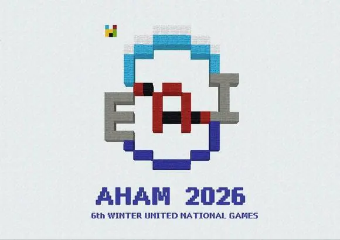
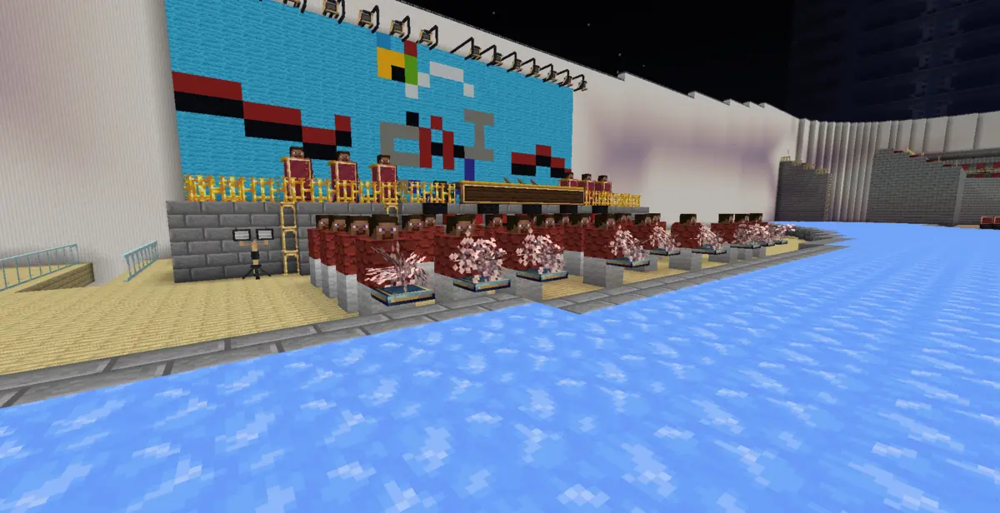
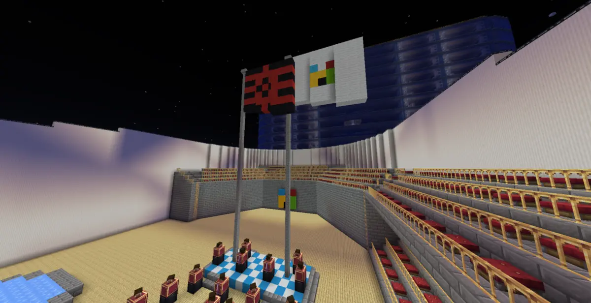
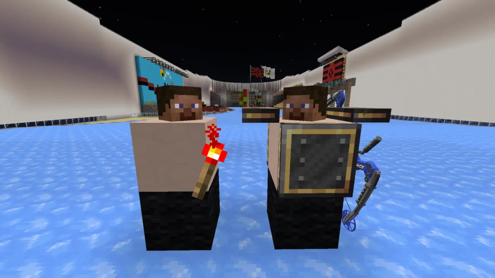
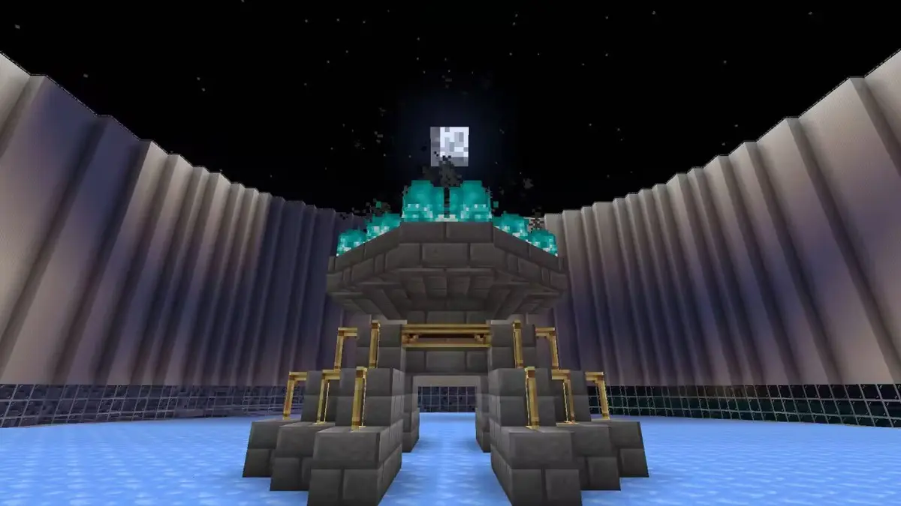
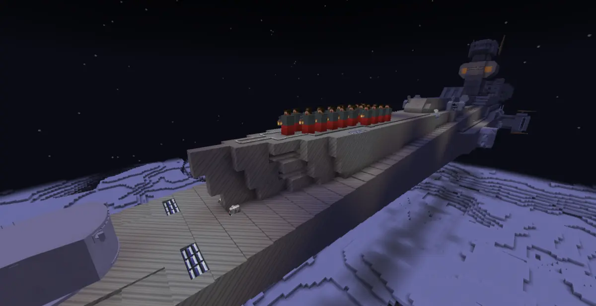
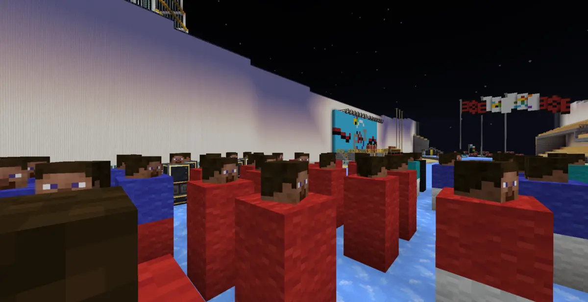
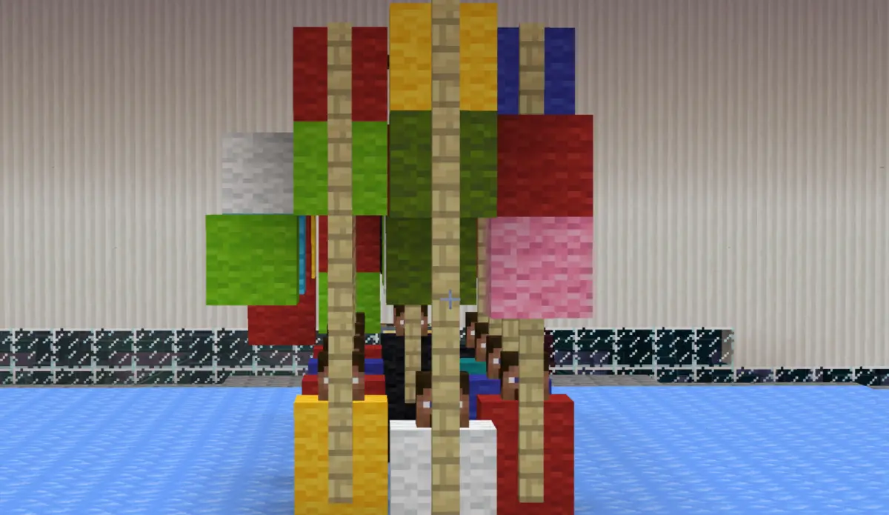
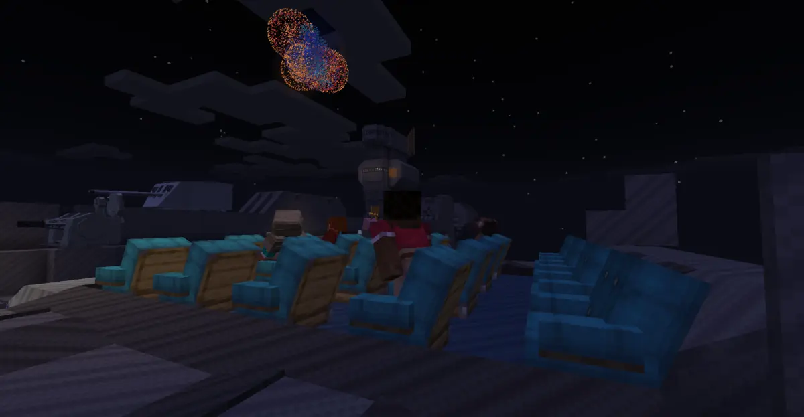

在第十二次联合运动会全会上，康普利特帝国亚罕市成功获得第六届冬季联合运动会的举办权。

---

2月5日晚20点，亚罕冬季联合运动会开幕式开始，康普利特的建设者路人炳为我们带来了壮观的开幕式。

*本届冬运会会徽以像素风格呈现，融合了冰雪元素与运动精神，象征着各文明在严寒中迸发的热情与活力。*

*开幕式现场，背景墙上巨大的会徽与彩旗交相辉映，樱花点缀的文艺表演为凛冽的冰雪赛场增添了一抹春意。*

*升旗仪式在庄严的氛围中进行。康普利特帝国国旗与联合运动会会旗在星空下冉冉升起。*

*运动员代表手持火炬亮相冰场，火炬手拿起弓箭，用弓箭点燃了主火炬塔。*

*主火炬台在夜色中熠熠生辉。由石砖构筑的主火炬塔在月光下闪烁着幽蓝的光芒，象征着运动员们追求卓越、永不熄灭的竞技精神。*

---

经过六个赛程日的奋战，来自各个虚拟文明的运动健儿们在这片冰雪赛场上挥洒汗水，取得了优异的成绩：
| 参赛方 | 金牌 | 银牌 | 铜牌 |
|--------|------|------|------|
| 北陆 | 3 | 1 | 0 |
| 格村联 | 2 | 2 | 0 |
| 芦田 | 1 | 0 | 1 |
| 奥里卡兹 | 0 | 1 | 0 |
| 天盛 | 0 | 1 | 0 |
| 个人参赛（youze0929） | 0 | 1 | 0 |
| 卡披洛 | 0 | 0 | 2 |

---

本次联合运动会首创冰壶特色项目，联合运动会的项目研发委员会基于现实中的冰壶比赛进行了精心改良。这一创新项目不仅保留了传统冰壶的策略性与团队协作精髓，更融入了虚拟世界的独特机制，使比赛更具观赏性与趣味性。赛事期间，这一改良广受参赛者好评，成为本届冬运会的一大亮点。

---

2月12日，亚罕冬联运会在璀璨星空下举行了隆重的闭幕式。各文明代表再次齐聚一堂，共同回顾这段难忘的冰雪记忆。

*康普利特皇家空军所属“麦哲伦”级宇宙战列舰二号舰载着演出的孩子们驶来。*

*参赛运动员们纷纷入场。*

*闭幕式上，来自各个文明代表队的旗手纷纷入场，一面面虚拟文明彩旗交织在一起，构成了一幅动人的画卷。*

*绚烂的烟火在夜空中绽放，为这场冰雪盛会画上了圆满的句号。嘉宾席上，来自各文明的代表们共同仰望这片璀璨的星空，许下对未来的美好期许。*

---

这届亚罕盛会，我们见证了运动员们的拼搏奋斗，见证了工作人员的无私奉献，见证了服务器维护人员的加班加点，更见证了联运与改吧的传统友谊不断巩固。衷心希望联运越办越好，我们的社区也越来越红火！
